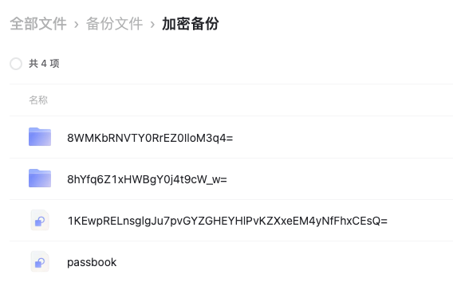
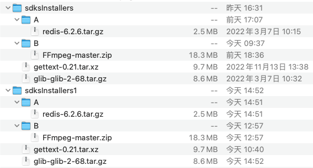

ARSYNC
============


并将文件名以及文件内容加密，备份到阿里云。基于[alipan-rs](https://github.com/niuhuan/alipan-rs)开发。

基于文件名和文件更新时间比对, 我主要用于文件容灾, 以及异地透过阿里云同步, 防止阿里云和谐等。

## 功能

1. 申请阿里云盘开发账号, 运行`arsync -c config.toml config `生成配置文件。

   ```shell
   > arsync config
   ```

2. 将本地的文件夹，同步到阿里云盘。

    ```bash
    > arsync -c config.toml up -s 'file:///Volumes/DATA/sdksInstallers' -t 'adrive:///1234567890/加密备份' -p password`
    向云端同步 : /Volumes/DATA/sdksInstallers
    上传至云端 : /Volumes/DATA/sdksInstallers/glib-glib-2-68.tar.gz
    向云端同步 : /Volumes/DATA/sdksInstallers/A
    上传至云端 : /Volumes/DATA/sdksInstallers/A/redis-6.2.6.tar.gz
    向云端同步 : /Volumes/DATA/sdksInstallers/B
    ```
3. 阿里云加密

   

4. 下载到本地

    ```bash
    arsync -c config.toml down -s 'adrive:///1234567890/加密备份' -t 'file:///Volumes/DATA/sdksInstallers1' -p password`
    从云端同步: /Volumes/DATA/sdksInstallers1
    从云端同步: /Volumes/DATA/sdksInstallers1/B
    从云端同步: /Volumes/DATA/sdksInstallers1/A
    ```

5. 本地恢复解密

   

## 特性

- [x] 云端文件加密
- [x] 本地文件加密

## 命令行

```shell
async -c config.toml config # 创建配置文件
async -c config.toml drives
async -c config.toml  up -s 'file:///文件夹路径/' -t 'adrive:///drive_id/文件夹路径' -p 密码` # 同步到阿里云盘
async -c config.toml  down -s 'adrive:///drive_id/文件夹路径' -t 'file:///文件夹路径/' -p 密码` # 从阿里云盘同步到本地
```

## 如何安装

```shell
> cargo install --git https://github.com/niuhuan/arsync.git
````

## 注意事项

1. 基于文件更新时间比对, 应该保证设备时间准备。
2. 无法使用api修改阿里云文件的修改时间, 应避免上传下载同时发生。
3. 请增加设备BIOS锁, 保证密码安全。

## 任务清单

- [ ] 输入式密码
- [ ] 更改云端密码功能

## 加密原理

每1MB进行一次AES256GCM
